# Prometni i signalni propisi

1.  **Željeznička pruga** je građevinski objekt koji se sastoji od dva
    osnovna konstrukcijska elementa: donjeg i gornjeg ustroja pruge.

2.  **Kolodvorsko područje** je prostor između ulaznog signala s jedne
    strane do ulaznog signala s druge strane, a gdje tih signala nema,
    kolodvorsko područje je prostor između prvih ulaznih skretnica s
    obiju strana. Područje izvan kolodvorskih područja naziva se
    otvorena pruga.

3.  **Pružni kolosijek** je kolosijek između prvih ulaznih skretnica
    dvaju susjednih kolodvora. Kolodvorski dio pružnog kolosijeka je dio
    kolosijeka na području kolodvora između prve ulazne skretnice i
    ulaznog signala.

4.  **Desni odnosno lijevi kolosijek kod dvokolosiječne pruge** je
    kolosijek koji se od početne točke prema krajnjoj točki pruge nalazi
    s desne odnosno s lijeve strane.

5.  **Kolosijeci u kolodvoru** mogu biti glavni i sporedni.

-   **Glavni kolosijek** je kolosijek namijenjen za prihvat i otpremu
    vlakova.

-   **Sporedni kolosijek** je kolosijek u kolodvoru koji se ne koristi
    za kretanje vlaka. Teretni vlakovi se mogu iznimno primati i
    otpremati sa sporednih kolosijeka uz propisivanje posebnih
    sigurnosnih mjera u Poslovnom redu kolodvora. Mogu služiti za
    manevriranje.

6.  **Glavni prolazni kolosijek** je kolodvorski kolosijek koji čini
    izravno produljenje pružnog kolosijeka. Vlak ulazi i izlazi vožnjom
    u pravac.

7.  **Nepravilan glavni prolazni kolosijek** je glavni prolazni
    kolosijek na koji vlak zbog njegove konstrukcije ulazi vožnjom u
    pravac, a izlazi vožnjom u skretanje ili obrnuto.

8.  **Službena mjesta:** kolodvori , otpremništva ,odjavnice ,
    rasputnice i stajališta.

9.  **Kolodvor** je službeno mjesto na pruzi s najmanje jednom
    skretnicom iz kojega se izravno ili daljinski regulira promet
    vlakova i u kojemu vlak otpočinje ili završava vožnju, ili se
    zaustavlja, ili koje prolazi bez zaustavljanja. U kolodvoru se može
    obavljati ulazak i izlazak putnika te utovar i istovar stvari.

10. **Vrste kolodvora:**

-   **Rasporedni -** kolodvor u kojem se, osim poslova propisanih za
    kolodvor, uvode u promet i otkazuju vlakovi

-   **Ranžirni -** kolodvor u kojem se sastavljaju i rastavljaju teretni
    vlakovi i koji je opremljen posebnom skupinom kolosijeka i
    postrojenjem za manevriranje (grbina ili spuštalica ( služi za
    guranje vagona ) i kolosiječna kočnica)

-   **Međukolodvor -** -- kolodvor koji se nalazi između dvaju
    rasporednih kolodvora

-   **Kolodvor prelaska s dvokolosiječne na jednokolosiječnu prugu** --
    kolodvor u kojem se regulira prelazak željezničkih vozila s
    dvokolosiječne na jednokolosiječnu prugu i obrnuto

-   **Granični kolodvor** - je kolodvor iz kojega se regulira promet
    između HŽ Infrastrukture i upravitelja željezničkom infrastrukturom
    susjedne države.

11. **Rasputnica** je službeno mjesto na otvorenoj pruzi u kojem se
    odvaja druga pruga.

12. **Stajalište** je službeno mjesto u kojem se vlakovi za prijevoz
    putnika zaustavljaju u skladu s voznim redom samo radi ulaska i
    izlaska putnika, a u kojem vlak za prijevoz putnika može početi ili
    završiti vožnju.

13. **Jednokolosiječna pruga** je pruga s jednim kolosijekom na
    otvorenoj pruzi po kojemu vlakovi voze u jednome ili u oba smjera.

14. **Dvokolosiječna pruga** je pruga s dva kolosijeka na otvorenoj
    pruzi na kojoj vlakovi istog smjera voze po kolosijeku određenome za
    taj smjer i koji se naziva **pravilan kolosijek**. Kolosijek na
    dvokolosiječnoj pruzi po kojemu vlak vozi suprotno od određenog
    smjera naziva se **nepravilan kolosijek**.

15. **Usporedne pruge** su dvije ili više pruga jedna uz drugu, po
    kojima se promet na jednoj pruzi odvija neovisno o prometu na drugoj
    pruzi.

16. **Početak i kraj pruge** je službeno mjesto ili kilometarski položaj
    u kojemu počinje ili u kojemu završava jedna pruga.

17. **Desnostrani promet** je vožnja vlakova na dvokolosiječnoj pruzi po
    desnom kolosijeku u smjeru kretanja vlaka.

18. **Desna ili lijeva strana pruge** je strana pruge koja se nalazi
    desno ili lijevo od pruge gledajući od početka prema kraju pruge.

19. **Desna ili lijeva strana kolosijeka je** strana kolosijeka koja se
    nalazi desno ili lijevo gledajući u smjeru vožnje.

20. **Obostrani promet** je vožnja vlakova na dvokolosiječnoj pruzi
    opremljenoj signalno-sigurnosnim uređajima koji omogućuju vožnju
    vlakova istog smjera po oba kolosijeka.

21. **»Zaustavni put«** je propisani najveći dopušteni put potpunog
    kočenja na pruzi odnosno na pružnoj dionici za vlak koji vozi
    najvećom dopuštenom brzinom. Duljina zaustavnog puta, ovisno o
    brzini na pruzi, može biti 700, 1000 ili 1500 metara. Zaustavni put
    određuje upravitelj infrastrukture i dužan ga je objaviti u Izvješću
    o mreži.

22. **»Vodeće vozilo«** je prvo vozilo u smjeru kretanja vlaka iz kojeg
    se upravlja vožnjom i kočenjem vlaka.

23. **Dopuštena infrastrukturna brzina** je najveća brzina kojom vlakovi
    smiju voziti na željezničkoj pruzi odnosno dijelu željezničke pruge
    ovisno o projektiranoj građevinskoj brzini i stvarnoj tehničkoj
    uporabnoj sposobnosti željezničkih infrastrukturnih podsustava.

24. **Najveća dopuštena brzina** **vlaka** je najveća brzina kojom vlak
    smije voziti na pruzi ili njezinu dijelu, a propisana je voznim
    redom, pisanim nalogom ili je signalizirana signalima.

25. **Lagana vožnja je** vožnja smanjenom brzinom. Smanjena brzina je
    brzina niža od dopuštene ili ograničene brzine, a uvodi se zbog
    tehničkog stanja pruge ili izvedbe radova. Ona je privremena i nije
    propisana voznim redom.

26. **Ograničena brzina** je brzina niža od dopuštene kojom se smije
    voziti preko dijela pruge, uvjetovana njezinim tehničkim stanjem ili
    brzina kojom se smije voziti preko skretnica uvjetovana njihovom
    konstrukcijom i načinom osiguranja. Ta brzina propisana je voznim
    redom i signalizirana signalnim znacima glavnih signala ili
    signalnim znacima signala za ograničenje brzine te je ona najveća
    dopuštena brzina za taj dio pruge.

27. **Signal** je sredstvo kojim se signalizira signalni znak propisan
    signalnim pravilnikom i ima značenje zapovijedi i upozorenja .
    **Željezničkim signalima** signaliziraju se i daju signalni znakovi
    kojima se željezničko osoblje brzo i pouzdano međusobno
    sporazumijeva o vožnji vlakova, manevriranju, zabranjenoj i
    dopuštenoj vožnji preko određenog mjesta, stanju na pruzi i potrebi
    smanjenja brzine.

**Signali mogu biti:**

-   **Stalni signal** je signal ugrađen na određenome mjestu.

-   **Prijenosni signal** je signal koji se prenosi s jednoga mjesta na
    drugo.

-   **Ručni signal** je za davanje ručnih signalnih znakova -- može
    davati prometnik

28. **Signalna oznaka je** ugrađeno signalno sredstvo kojim se označava
    ili upozorava na posebno važno mjesto na pruzi ili u službenom
    mjestu.

29. **Signalni znak** je znak koji može imati značenje zapovijedi ili
    upozorenja.

**Signalni znak može biti:**

-   **Jednoznačni signalni znak** je signalni pojam koji ima jedno
    značenje.

-   **Dvoznačni signalni znak** je signalni pojam koji istodobno
    zapovijeda postupak kod odnosnoga glavnog signala i predsignalizira
    signalni znak sljedećega glavnog signala.

30. **Stupovi glavnih signala** koji signaliziraju **jednoznačne**
    signalne znakove obojeni su s **prednje strane naizmjenično**
    **bijelim i crnim poljima**, a stupovi glavnih signala koji
    signaliziraju **dvoznačne** signalne znakove obojeni su **s prednje
    strane bijelim i crvenim poljima.** Bijela i crvena polja glavnih
    signala moraju biti prevučena reflektirajućom materijom.

31. **Kod dvoznačnih glavnih svjetlosnih signala** signalni znakovi
    signaliziraju se mirnom, trepćućom ili mirnom i trepćućom obojenom
    svjetlošću.

32. **Glavni signali** su signali koji signaliziraju signalne znakove
    kojima se zabranjuje ili dopušta daljnja vožnja vlaka redovnom ili
    ograničenom brzinom**.** Mogu biti svjetlosni i likovni. **Glavni
    signali** ugrađeni na području kolodvora nazivaju se kolodvorski
    glavni signali, a na otvorenoj pruzi pružni glavni signali.

> **Glavni signal** redovno mora signalizirati **signalni znak »Stoj«.**

**Razmak između susjednih glavnih signala** kojima se regulira vožnja
uzastopnih vlakova ne smije biti kraći od duljine zaustavnog puta.
Iznimno se može taj razmak smanjiti najviše za 5%.

**Kod određivanja mjesta ugradnje** glavnih signala mora se ostvariti
propisana vidljivost.

33. **Vrste glavnih signala:**

-   **Ulazni signal --** njime se zabranjuje ili dopušta ulazak vlaka u
    kolodvor. Ugrađuju se najmanje 100 m ispred prve ulazne skretnice,
    odnosno 200 m ako je pruga u padu u duljini od 2 km.

-   **Izlazni signal --** njime zabranjuje se ili dopušta izlazak vlaka
    iz kolodvora. Izlazni signal koji signalizira izlazak s jednog
    kolosijeka naziva se **kolosiječni** izlazni signal, a izlazni
    signal koji signalizira izlazak iz skupine kolosijeka ili iz svih
    kolosijeka naziva se **skupinski** izlazni signal.

-   **Prostorni signal --** njime se zabranjuje se ili dopušta ulazak
    vlaku u prostorni odsjek, opremljeni su automatskim pružnim blokom
    (APB-om). Postavljen je na otvorenoj pruzi, između dva kolodvora ili
    postaje

-   **Zaštitni signali** mogu biti ugrađeni u kolodvoru i na otvorenoj
    pruzi. Zaštitnim signalom zabranjuje se ili dopušta vožnja vlaka:
    preko rasputnice, odjavnice, otpremništva, preko stajališta na
    dvokolosiječnoj pruzi ili na dvije usporedne pruge, preko mjesta na
    kojem dvokolosiječna pruga prelazi u jednokolsiječnu, preko mjesta
    gdje se odvaja industrijski kolosijek na otvorenoj pruzi i preko
    dijela kolodvorskog područja. Ugrađuju se najmanje na 100m ispred
    prve ulazne skretnice.

34. **Kada je glavni svjetlosni signal** neosvijetljen ili kada
    signalizira nejasne signalne znakove **vlak se mora zaustaviti
    ispred glavnog signala** , smatra se da signalizira **STOJ. Ulazni
    glavni** ne smije proći bez dozvole prometnika, **a prostorni**
    nakon tri min ako nismo uspjeli stupili u kontakt sa prometnikom i
    to brzinom do 30 km/h.

35. **Strojovođa zna da smije proći kolodvor koji nema izlazni glavni
    signal** kada mu prometnik da signalni znak polazak ( kada vlak ima
    zaustavljanje )ili signalni znak prolazak slobodan sa loparom ili
    signalnom lampom .

36. **Signalni znakovi svjetlosnih glavnih signala:**

-   Jednoznačni i dvoznačni signalni znak »**Stoj«** -- jedna crvena
    mirna svjetlost (slika 1).

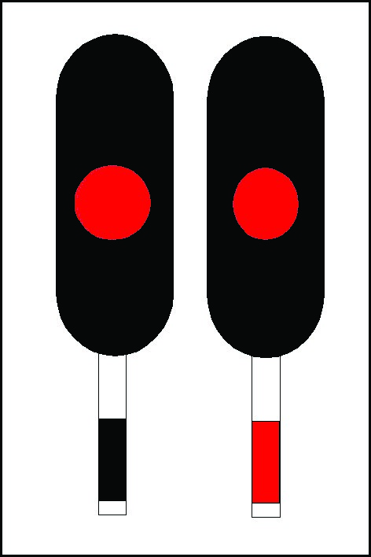

Slika 1.

**Signalizira** da je daljnja **vožnja od signala zabanjena.**

-   Jednoznačni signalni znak »**Slobodno«** -- jedna zelena mirna
    svjetlost (slika 2).

> 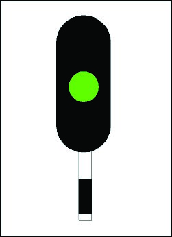

Slika 2.

**Signalizira** da je vožnja od signala **slobodna najvećom dopuštenom
brzinom.**

-   Dvoznačni signalni znak **»Slobodno, očekuj Slobodno ili Oprezno«**
    -- jedna zelena mirna svjetlost (slika 3)

> 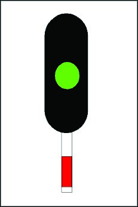
>
> Slika 3.
>
> **Prolazak pored signala** bez smanjivanja brzine do sljedećeg glavnog
> signala, te da na sljedećem signalu **očekujemo slobodno ili
> oprezno.**

-   Dvoznačni signalni znak **»****Oprezno, očekuj Stoj«** -- jedna žuta
    mirna svjetlost (slika 4)

> 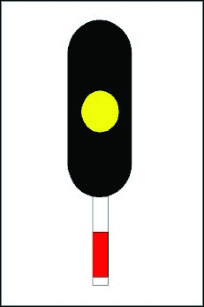
>
> Slika 4.
>
> **Signalizira da je vožnja** od signala slobodna, te da smanjimo
> brzinu i da na sljedećem glavnom signalu **očekujemo stoj.**

-   Dvoznačni signalni znak **»****Slobodno, očekuj ograničenje
    brzine«** -- jedna zelena trepćuća svjetlost (slika 5).

> 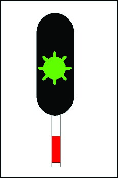
>
> Slika 5.
>
> **Signalizira da je vožnja od signala slobodna najvećom dopuštenom
> brzinom**, te da na sljedećem **glavnom signalu očekujemo ograničenje
> brzine.**

-   Dvoznačni signalni znak **»****Ograničena brzina, očekuj Stoj«** --
    jedna žuta trepćuća svjetlost i ispod nje jedna žuta mirna svjetlost
    (slika 6).

> 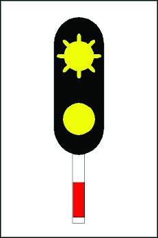
>
> Slika 6.
>
> **Signalizira da je vožnja od signala slobodna** te da **ograničimo
> brzinu** i da na sljedećem glavnom signalu **očekujemo stoj.**

-   Dvoznačni signalni znak **»Ograničena brzina, očekuj Slobodno ili
    Oprezno«** -- jedna žuta trepćuća svjetlost i ispod nje jedna zelena
    mirna svjetlost (slika 7).

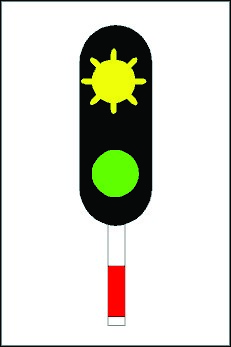

Slika 7.

**Signalizira** da je vožnja od signala **slobodna ograničenom brzinom**
i da na sljedećem glavnom **signalu očekujemo slobodno ili oprezno.**

-   Dvoznačni signalni znak **»****Ograničena brzina, očekuj ograničenje
    brzine«** -- jedna žuta trepćuća svjetlost i ispod nje jedna zelena
    trepćuća svjetlost (slika 8).

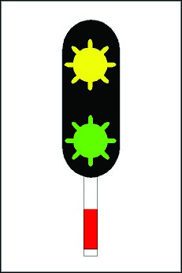

Slika 8

Signalizira da je vožnja od **signala slobodna ograničenom brzinom** i
da na sljedećem glavnom signalu očekujemo **ograničenje brzine.**

-   Jednoznačni signalni znak **»Ograničena brzina« --** jedna žuta
    trepćuća svjetlost i ispod nje jedna zelena mirna svjetlost (slika
    9).

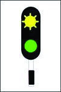

**Slika 9 .**

**Signalizira** da je vožnja **od signala slobodna** , te da treba
**voziti ograničenom brzinom.**

-   Jednoznačni signalni znak **»Ograničena brzina« --** jedna zelena
    mirna i ispod nje jedna žuta mirna svjetlost (slika 10).

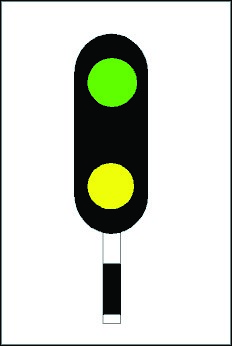

Slika 10.

**Signalizira** da je vožnja **od signala slobodna** te da treba voziti
**ograničenom brzinom.**

-   Jednoznačni i dvoznačni signalni znak **»****Oprezna vožnja brzinom
    do 20 km/h«** -- jedna crvena mirna i ispod nje jedna žuta trepćuća
    svjetlost (slika 11).

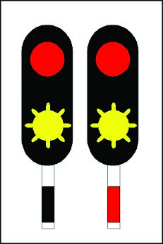

Slika 11.

-   **Signalni znak »Oprezna vožnja brzinom do 20 km/h«** rabi se u
    slučaju kada vlak mora ući u kolodvor s osobitom opreznošću na
    zauzeti kolosijek ili na kolosijek koji je prohodan do određenog
    mjesta, kada nije osiguran put proklizavanja te u slučaju kada se ne
    može dati signalni znak za dopuštenu vožnju zbog neispravnosti
    signalno-sigurnosnog uređaja

37. **Likovni signali** signaliziraju signalne znakove danju položajem
    ili obojenim likom odnosno položajem i obojenim likom, a noću
    obojenom mirnom svjetlošću uz dnevni znak ili samo dnevnim znakom.
    Signaliziraju jednoznačne signalne znakove.

38. **Signalni znakovi signaliziraju** se brojem i položajem ručica, a
    noću obojenom mirnom svjetlošću pokraj dnevnog znaka.

39. **Likovni glavni signali:**

-   Signalni znak **»Stoj« dnevni znak** -- jedna signalna ručica
    položena vodoravno desno u odnosu na vozni smjer (slika 131)

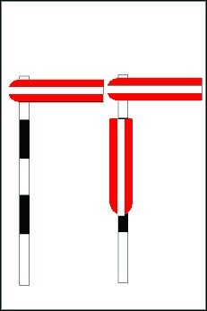

Slika 131 .

-   Signalni znak **»Stoj«** **noćni znak** -- jedna crvena mirna
    svjetlost pokraj dnevnog znaka (slika 132)

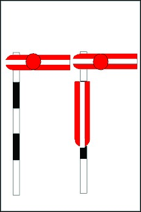

Slika 132.

-   Signalni znak **»Slobodno« dnevni znak** -- signalna ručica
    uzdignuta koso naviše desno u odnosu na vozni smjer (slika 133)

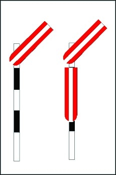

Slika 133.

-   Signalni znak **»Slobodno« noćni znak** -- jedna zelena mirna
    svjetlost pokraj dnevnog znaka (slika 134)

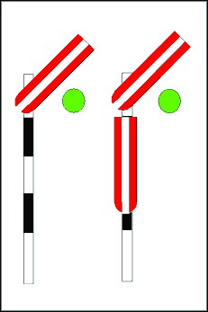

Slika 134 .

-   Signalni znak **»Ograničena brzina« dnevni znak --** dvije signalne
    ručice uzdignute koso naviše desno u odnosu na smjer vožnje (slika
    135)

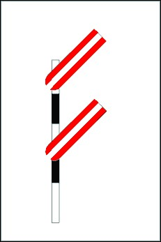

Slika 135 .

-   Signalni znak **»Ograničena brzina« noćni znak** -- jedna zelena
    mirna i ispod nje jedna žuta mirna svjetlost pokraj dnevnog znaka
    (slika 136)

> 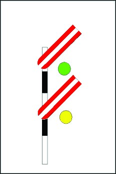

Slika 136 .

40. **Predsignal** se ugrađuje ispred glavnog signala na udaljenosti
    zaustavnog puta. Izuzetno se predsignal može ugraditi na udaljenosti
    5% manjoj od duljine zaustavnog puta. Udaljenost predsignala ispred
    glavnog signala ne smije biti veća od duljine jednog i pol
    zaustavnog puta propisanog za tu pružnu dionicu. Mogu biti
    svjetlosni i likovni.

41. **Predsignal se razlikuje od glavnog signala** po tome što je
    predsignal na vrhu odrezan, a glavni zaobljen. Kod predsignala se
    nalazi predsignalna opomenica.

42. **Postupak strojovođe kod kvara predsignala:** strojovođa postupa
    kao da je **signalni znak očekuj stoj,** strojovođa prolazi pored
    tog predsignala i smanjuje brzinu dok ne vidi signalni znak glavnog
    signala.

43. **Signalni znakovi svjetlosnih predsignala:**

-   Signalni znak **»Očekuj Stoj**« -- jedna žuta mirna svjetlost
    **(**slika 12).

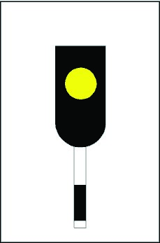

Slika 12

-   Signalni znak **»Očekuj Slobodno**« -- jedna zelena mirna svjetlost
    (slika 13).

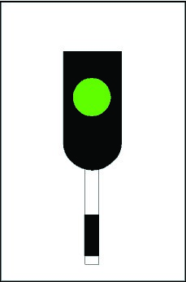

Slika 13

-   Signalni znak »**Očekuj ograničenje brzine**« -- jedna zelena
    trepćuća svjetlost (slika 14

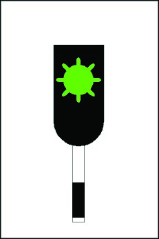

Slika 14

44. **Likovnim predsignalom** signalizira se dva signalna znaka

-   **Očekuj Stoj i**

-   **Očekuj Slobodno.**

> **Signalni znakovi signaliziraju** se položajem signalne ploče, a noću
> obojenom mirnom svjetlošću pokraj dnevnog znaka.
>
> **Likovni predsignal ima četverokutnu signalnu ploču** obojenu
> naizmjeničnim uspravnim bijelim i žutim linijama s crno-bijelim rubom.
>
> **Stup likovnog predsignala** s prednje strane obojen je naizmjenično
> bijelim i crnim poljima.

45. **Likovni predsignali:**

-   Signalni znak »**Očekuj Stoj« dnevni znak** -- signalna ploča u
    uspravnom položaju (slika 137)

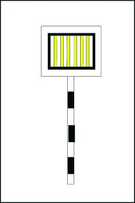

Slika 137

-   Signalni znak »**Očekuj Stoj**« **noćni znak** -- jedna žuta mirna
    svjetlost pokraj dnevnog znaka (slika 138)

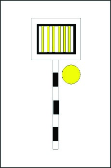

Slika 138

-   Signalni znak »**Očekuj Slobodno« dnevni znak** -- signalna ploča u
    vodoravnom položaju s crnim rubom okrenutim prema vlaku (slika 139)

Slika 139

-   Signalni znak »**Očekuj Slobodno« noćni znak** -- jedna zelena mirna
    svjetlost pokraj dnevnog znaka (slika 140)

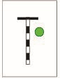

Slika 140

46. **Ponavljač predsignaliziranja** signalizira signalni znak jednak
    signalnome znaku kojim je predsignaliziran signalni znak glavnoga
    signala, a ispod signalnoga znaka ima i jednu mirnu mliječnobijelu
    svjetlost.

47. **Ponavljač predsignaliziranja** mora se ugraditi ispred glavnog
    signala kod kojega radi konfiguracije terena nije postignuta
    propisana daljina vidljivosti. Zbog nepovoljne konfiguracije terena
    moguće je ugraditi i više ponavljača predsignaliziranja.

48. **Postupak kod neispravnosti ponavljača predsignaliziranja (
    strojovođa ) -** kada je ponavljač predsignaliziranja neosvijetljen,
    kada je signalni znak nejasan ili kada svijetli samo mliječnobijela
    svjetlost, postupa se kao da **signalizira signalni znak »Glavni
    signal signalizira Stoj«.**

49. **Ponavljači predsignaliziranja su:**

-   Signalni znak **»Glavni signal signalizira Stoj«** -- jedna žuta
    mirna i ispod nje jedna mliječnobijela svjetlost (slika 15).

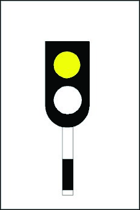

Slika 15

-   Signalni znak **»Glavni signal signalizira Slobodno« --** jedna
    zelena mirna i ispod nje jedna mliječnobijela svjetlost (slika 16).

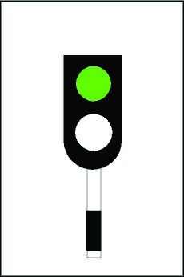

Slika 16

-   Signalni znak **»Glavni signal signalizira ograničenje brzine«** --
    jedna zelena trepćuća i ispod nje jedna mliječnobijela svjetlost
    (slika 17).

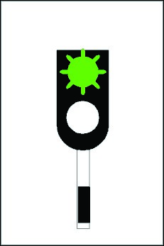

Slika 17

61. **Pokazivač brzine** dopunski je signal ulaznog signala. On
    signalizira kojom se brzinom smije voziti preko pripadajućega
    skretničkog područja kada ulazni signal signalizira daljnju vožnju
    ograničenom brzinom**. Broj na pokazivaču brzine** **množi se s 10**
    kako bi se dobila brzina kojom se smije voziti.

62. **Pokazivač brzine obavezno se ugrađuje:**

-   za ulazak na glavne krnje kolosijeke ili prvi odsjek glavnog
    kolosijeka podijeljenoga na ograničene odsjeke voznog puta. U tom
    slučaju najveća dopuštena brzina je 30 km/h.

-   za ulazak teretnih vlakova na glavne kolosijeke koji na izlaznoj
    strani nemaju stalno osiguran put proklizavanja. U tom slučaju
    najveća dopuštena brzina je 20 km/h.

63. **Pokazivač brzine:**

-   **Signalni znak »Voziti ograničenom brzinom \.... km/h«** --
    svjetleća bijela brojka na crnoj četverokutnoj ploči (slika 18).

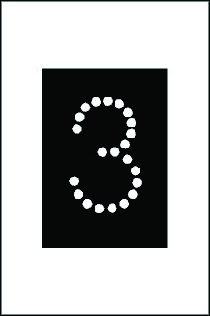

Slika 18

64. **Granični kolosiječni signal namijenjen je:**

-   za podjelu glavnog kolosijeka na ograničene odsjeke voznog puta,

-   za označavanje kraja glavnog kolosijeka koji nije opremljen glavnim
    signalom,

-   za označavanje granice kolodvorskog područja ili skupine kolosijeka.

65. **Signalni znak »Vožnja dopuštena« za vučno vozilo bez pratitelja
    kod manevriranja** vrijedi kao zapovijed za pokretanje. Ako ispred
    signala stoji više nezakvačenih vučnih vozila, signalni znak »Vožnja
    dopuštena« vrijedi samo za prvo vučno vozilo.

66. **Kada je granični kolosiječni signal neispravan** ili kada
    signalizira nejasne signalne znakove, smatra se da signalizira
    signalni znak **»Vožnja zabranjena«.**

67. **Stupovi graničnih kolosiječnih signala** obojeni su s prednje
    strane naizmjenično bijelim i crnim poljima.

68. **Redovni signalni znak** graničnoga kolosiječnog signala je
    **»Vožnja zabranjena«.**

69. **Granični kolosiječni signali:**

-   Signalni znak **»Vožnja zabranjena«** -- dvije crvene mirne
    vodoravne svjetlosti (slika 19).

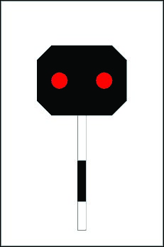

Slika 19

-   Signalni znak **»Vožnja dopuštena«** -- dvije mliječnobijele mirne
    kose svjetlosti (slika 20).

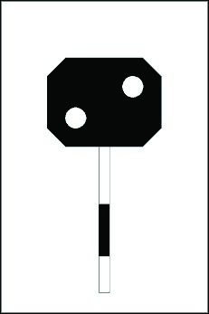

Slika 20 .

> **Signalnim znakom »Vožnja dopuštena«** dopušta se daljnja vožnja:

-   do sljedećega manevarskog signala,

-   do sljedećega graničnoga kolosiječnog signala,

-   do vozila na kolosijeku odnosno do mjesta do kojeg je kolosijek
    slobodan,

-   do međnika ili do signala kraja krnjeg kolosijeka ukoliko nema
    signala, vozila ili mjesta iz prethodnih podstavaka.

70. **Manevarski signali** namijenjeni su za zaštitu voznog puta vlaka
    od manevarske vožnje, osiguranje i zaštitu manevarskih voznih
    putova, signaliziranje položaja iskliznice, signaliziranje dopuštene
    ili zabranjene vožnje preko okretnice te označavanje mjesta do
    kojega je dopušteno redovno manevriranje.

71. **Manevarski signali su:**

-   Signal za zaštitu voznog puta

-   Signal iskliznice

-   Signal okretnice

-   Signal granica manevriranja

72. **Manevarski signal za zaštitu voznog puta** signalizira zabranjenu
    ili dopuštenu vožnju od toga signala. Obojen je crnom bojom, a sa
    stražnje strane i dvjema žutim kosim prugama prevučenim
    reflektirajućom materijom.

73. **Manevarski signali za zaštitu voznog puta ugrađuju se** ispred
    izoliranoga skretničkog sastava ili iskliznice pri samom tlu, s
    kojima moraju biti u tehničkoj ovisnosti.

74. **Kada je manevarski signal za zaštitu voznog puta neispravan** ili
    kada signalizira nejasne signalne znakove, smatra se da
    **signalizira signalni znak »Manevriranje zabranjeno«.**

75. **Strojovođa smije proći** Signalni znak **»Manevriranje slobodno«**
    signaliziran manevarskim signalom za zaštitu voznog puta vrijedi za
    manevarsku vožnju samo tada kada glavni signal signalizira signalni
    znak »Stoj«. Znači da ga smije proći kada manevarski signal pokazuje
    bijelo mirno, a glavni signal crveno mirno.

76. **Signalni znakovi manevarskog signala za zaštitu voznog puta:**

-   Signalni znak **»Manevriranje zabranjeno«** -- jedna crvena mirna
    svjetlost (slika 21).

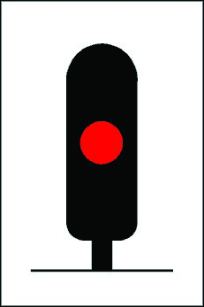

Slika 21

-   Signalni znak **»Manevriranje slobodno«** -- jedna bijela mirna
    svjetlost (slika 22).

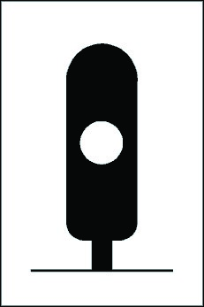

Slika 22

Signalnim znakom **»Manevriranje slobodno«** **dopušta se daljnja vožnja
do**:

-   sljedećega manevarskog signala,

-   sljedećega graničnoga kolosiječnog signala,

-   do vozila na kolosijeku odnosno do mjesta do kojeg je kolosijek
    slobodan,

-   do međnika ili do signala kraj krnjeg kolosijeka ukoliko nema
    signala, vozila ili mjesta iz prethodnih podstavaka.

77. **Signal iskliznice** označava njezin položaj i signalizira signalni
    znak kojim se zabranjuje manevriranje preko toga mjesta. Dopuštena
    vožnja preko iskliznice ne signalizira se.

78. **Signal iskliznice ugrađuje** se iza međnika skretnice kako
    slijedi:

-   kod skretnica i iskliznice koje se postavljaju na licu mjesta,
    najmanje 4,5 metara od međnika,

-   kod skretnica i iskliznice koje se postavljaju s centralnog mjesta,
    najmanje 6 metara od međnika.

79. Signalni znak **»Manevriranje zabranjeno«** -- uspravna kvadratna
    plava ploča s bijelim rubom zakrenuta za 45 stupnjeva, prevučena
    reflektirajućom materijom (slika 23).

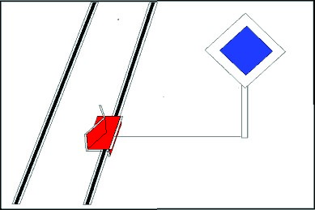

Slika 23

80. **Signal okretnice** označava mjesto i njezin položaj i signalizira
    signalni znak kojim se zabranjuje ili dopušta vožnja na okretnicu
    ili s nje.

81. **Signali okretnice su:**

-   Signalni znak **»Manevriranje zabranjeno«** -- uspravna kvadratna
    plava ploča s bijelim rubom zakrenuta za 45 stupnjeva, prevučena
    reflektirajućom materijom (slika 24).

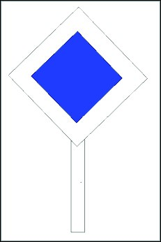

Slika 24

-   Signalni znak **»Manevriranje slobodno«** -- uspravni bijeli
    pravokutnik prevučen reflektirajućom materijom na crnoj podlozi u
    oba smjera vožnje (slika 25).

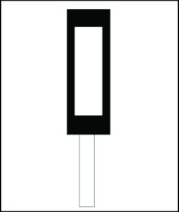

Slika 25

82. **Signal granica manevriranja** označava mjesto na pružnom
    kolosijeku u kolodvorskom području do kojega se smiju obavljati
    manevarske vožnje iz kolodvora.

83. **Signal granica manevriranja** na jednokolosiječnim prugama
    ugrađuje se s desne strane kolosijeka najmanje 50 m ispred ulaznog
    signala u smjeru izlaza iz kolodvora, na dvokolosiječnim prugama s
    vanjske strane ulaznog kolosijeka, a na prugama s obostranim
    prometom s vanjske strane obaju kolosijeka najmanje 50 m ispred
    ulaznih signala u smjeru izlaza iz kolodvora.

84. **Strojovođa smije proći signal granice manevriranja** uz pismeno
    odobrenje prometnika vlakova.

85. Signalni znak **»Granica manevarskih vožnji«** -- stup ili ploča
    obojena naizmjenično plavim i bijelim poljima prevučenim
    reflektirajućom materijom (slika 26).

> 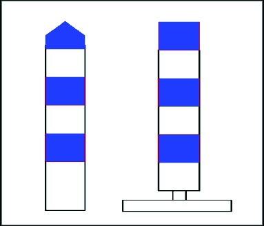

Slika 26

**Signal granica manevriranja** označava mjesto na pružnom kolosijeku u
kolodvorskom području do kojega se smiju obavljati manevarske vožnje iz
kolodvora.

**Signal granica manevriranja** na jednokolosiječnim **prugama
ugrađuje** se s desne strane kolosijeka najmanje 50 m ispred ulaznog
signala u smjeru izlaza iz kolodvora, na **dvokolosiječnim prugama** s
vanjske strane ulaznog kolosijeka.

**Strojovođa ga smije proći samo uz pisani nalog.**

86. **Skretnica:**

-   **Redovan položaj** je propisani položaj u koji skretnica mora biti
    postavljena kada se preko nje ne predviđa vožnja.

-   **Pravilan položaj** je položaj u koji skretnica mora biti
    postavljena za predstojeću vožnju vlaka odnosno vozila. Kada se
    vožnja mora obaviti preko skretnice koja je u redovnom položaju,
    onda se taj položaj smatra pravilnim položajem.

87. **Signalni znakovi jednostrukih skretnica:**

-   Signalni znak **»Vožnja u pravac uz jezičak ili niz jezičak«** --
    bijeli uspravni pravokutnik na crnoj podlozi u oba smjera vožnje
    (slika 27).

> 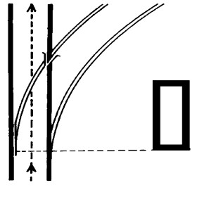

Slika 27

-   Signalni znak »**Vožnja u skretanje«** uz jezičak -- bijela strelica
    na crnoj podlozi s vrhom okrenutim u smjeru skretanja (slike 28 i
    29)

> 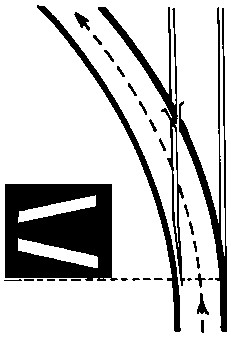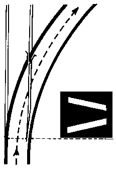

Slika 28 Slika 29

-   Signalni znak »**Vožnja u skretanje«** niz jezičak -- bijeli
    vodoravni pravokutnik na crnoj podlozi (slika 30)

> 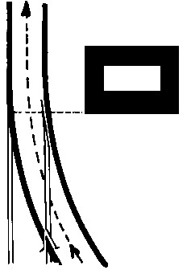

Slika 30

88. **Signal međnik** signalizira mjesto između dvaju kolosijeka koji se
    spajaju i do kojeg se smiju nalaziti vozila kako ne bi ugrožavala
    vožnju po susjednom kolosijeku.

-   Signalni znak **»Međnik«** -- bijela vodoravno ugrađena gredica s
    crno obojenim krajevima; (slika 35).

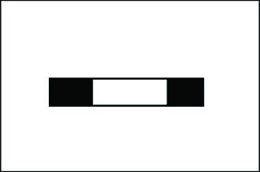

Slika 35

89. **Signal granica odsjeka** signalizira mjesto koje vozila moraju
    osloboditi ili zauzeti kako bi se omogućilo rukovanje signalima i
    skretnicama.

-   Signalni znak **»Granica odsjeka«** poklopac kabelske glave
    izoliranog odsjeka ili stupić obojen žuto-crveno (slika 36)

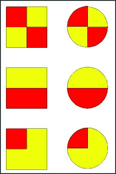

Slika 36

-   Signalni znak **»Granica odsjeka«** poklopac kućišta brojila osovina
    obojen srebrnastom bojom sa žutom trakom okomitom na kolosijek
    (slika 37)

Slika 37

90. **Signal kraj krnjeg kolosijeka** signalizira kraj krnjeg
    kolosijeka. **Ugrađuje se** u sredini kraja krnjeg kolosijeka.

-   Signalni znak **»Kraj krnjeg kolosijeka«** -- crna kvadratna ploča s
    dva bijela polukruga prevučena reflektirajućom materijom (slika 38).

> 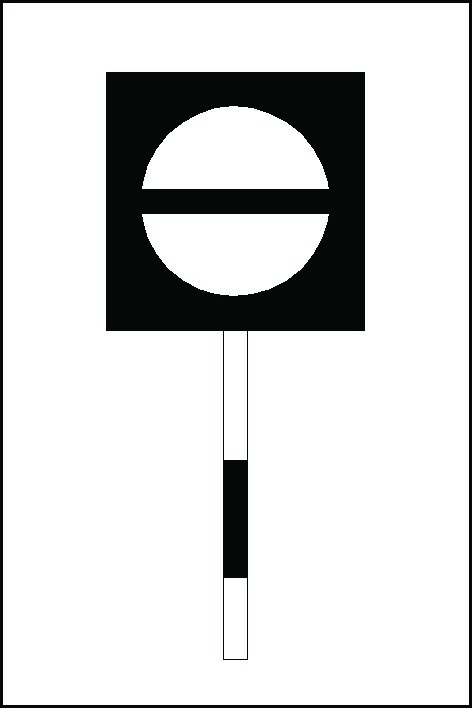

Slika 38

91. **Signalima za ograničenje brzine** signaliziraju se i ograničene
    brzine preko skretnica na pruzi i glavnom prolaznom kolosijeku glede
    njihove konstrukcije i načina osiguranja, ako nisu signalizirane
    pokazivačima brzine.

92. **Predsignalna ploča** s jednim brojem vrijedi za sve vlakove. Na
    predsignalnoj ploči s dva broja donji broj vrijedi za vlakove s
    nagibnom tehnikom koja je ispravna i uključena, a gornji broj
    vrijedi za sve ostale vlakove.

93. Signalni znak **»Očekuj ograničenje brzine«** -- bijela ploča u
    obliku kvadrata ili pravokutnika prevučena reflektirajućom materijom
    s jednim ili dva crna broja -- predsignalna ploča (slike 39 i 40).

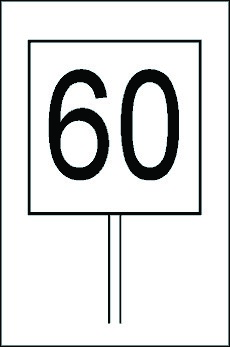

Slika 39 Slika 40

94. Signalni znak **»Početak ograničene brzine«** -- bijela kvadratna
    ploča prevučena reflektirajućom materijom s trima kosim crnim
    prugama naviše s lijeva nadesno -- početna ploča (slika 45).

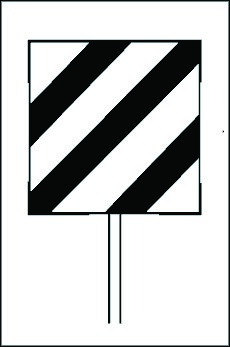

Slika 45

95. Signalni znak **»Kraj ograničene brzine«** -- bijela kvadratna ploča
    prevučena reflektirajućom materijom s dvjema uspravnim crnim prugama
    -- završna ploča (slika 46).

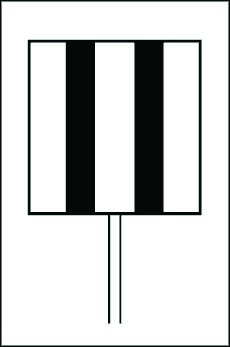

Slika 46

96. **Ispravnost automatskih uređaja** za osiguranje prometa na
    prijelazima, koje u rad uključuje nailazeći vlak, kontrolira se na
    dva načina:

-   kontrolnim svjetlosnim signalima ugrađenima pokraj kolosijeka na
    propisanoj udaljenosti ispred prijelaza

-   kontrolnim uređajima s daljinskom kontrolom u zaposjednutome
    službenom mjestu.

97. **Kontrolni svjetlosni signali ugrađuju se** ispred prijelaza na
    udaljenosti zaustavnog puta. Iznimno, kontrolni svjetlosni signali
    se mogu ugraditi na udaljenosti do 5% manjoj od zaustavnog puta ili
    na većoj udaljenosti, ali najviše do 2,5 duljine zaustavnog puta.

98. **Postupak strojovođe kod kvara je** Signalni znak **»Uređaj na
    željezničko-cestovnom prijelazu neispravan«** -- jedna žuta mirna
    svjetlost.

99. **Kontrolni svjetlosni signali:**

-   Signalni znak **»Uređaj na željezničko-cestovnom prijelazu
    ispravan«** -- jedna bijela trepćuća svjetlost i ispod nje jedna
    žuta mirna svjetlost (slika 47).

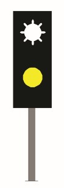

Slika 47

-   Signalni znak **»Uređaj na željezničko-cestovnom prijelazu
    neispravan«** -- jedna žuta mirna svjetlost (slika 48).

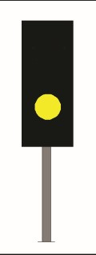

Slika 48

-   **Kontrolni svjetlosni signal koji je zajednički za više prijelaza**
    ima na stupu ugrađen bijeli romb s crnim brojem na crnoj kvadratnoj
    ploči. Taj broj označava za koliko je prijelaza signal zajednički.
    Bijela podloga prevučena je reflektirajućom materijom (slika 49). U
    tom slučaju signalni znak kontrolnog signala odnosi se na ukupni
    broj prijelaza nakon signala označen crnim brojem u bijelome rombu.

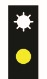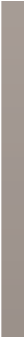

Slika 49

-   Kontrolni svjetlosni signal ugrađen na udaljenosti manjoj od duljine
    zaustavnog puta ima na stupu ugrađen bijeli trokut prevučen
    reflektirajućom materijom obrubljen crno s vrhom okrenutim naniže
    (slika 49a).

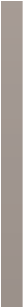

Slika 49a

100. **Pomoćni i kontrolni signali koji se više ne ugrađuju:**

-   **Signalni znak »Uređaj na željezničko-cestovnom prijelazu
    ispravan«** -- jedna bijela mirna svjetlost i ispod nje jedna žuta
    mirna svjetlost (slika 141).


Slika 141

-   **Pomoćni kontrolni svjetlosni signal na stupu ima ugrađen bijeli
    krug** na crnom polju prevučen reflektirajućom materijom (slika
    142).


Slika 142

101. **Signalni znak »Uključna točka,** **očekuj kontrolni signal«**
     znači da se mora motriti signalizira li kontrolni svjetlosni signal
     signalni znak »Uređaj na željezničko-cestovnom prijelazu ispravan«
     ili signalni znak »Uređaj na željezničko-cestovnom prijelazu
     neispravan«. Kontrolira se prelaskom prve osovine vlaka.

102. Signalni znak **»Uključna točka, očekuj kontrolni signal«** --
     uspravna pravokutna crna ploča sa četiri bijela romba jedan ispod
     drugoga prevučenim reflektirajućom materijom (slika 50).


Slika 50

103. **Ako je signal koji pokazuje signalni znak »Uključna točka, očekuj
     kontrolni signal« zajednički za više prijelaza tada** na vrhu ima
     ugrađenu dodatnu oznaku bijeli romb s crnim brojem na crnoj
     kvadratnoj ploči (slika 51) pri čemu je bijela podloga prevučena
     reflektirajućom materijom. Taj broj označava za koliko je prijelaza
     signal zajednički. U tome slučaju, odredbe propisane stavcima 2.
     do 4. ovoga članka odnose se na ukupni broj prijelaza nakon signala
     označen crnim brojem u bijelome rombu.

> 

Slika 51

104. **Signalni znak »Uključna točka s daljinskom kontrolom« označava
     mjesto na** kojemu je ugrađena uključna točka automatskog uređaja
     za osiguranje prijelaza i signalizira da vlak mora u određenom
     vremenu proći prijelaz ( u roku 4 min ) . U suprotnom prijelaz se
     smatra neosiguranim ( kada je neispravan dolazi čelom vlaka do ŽCP
     -a i zaustavlja se, daj signalni znak upozorenja i kada se uvjeri
     da je sve u redu, tada preko njega prelazi brzinom do 10 km/h ).
     Broj rombova označava za koliko je prijelaza uključna točka
     zajednička

105. **Signalni znak »Uključna točka s daljinskom kontrolom«** --
     uspravna pravokutna bijela ploča s jednim ili više crvenih rombova
     jednim ispod drugoga, prevučenim reflektirajućom materijom (slika
     52).


Slika 52

106. **Signalni znak »Početak zaustavnog puta ispred
     željezničkocestovnog prijelaza«** signalizira **mjesto početka
     kočenja** kako bi se vlak zaustavio ispred prijelaza kada je uređaj
     za osiguranje prijelaza neispravan.

107. **Signalni znak »Početak zaustavnog puta ispred
     željezničkocestovnog prijelaza«** -- stup ili bijela ploča s
     crvenim vrhom, prevučenim reflektirajućom materijom (slika 53).


Slika 53

108. **Signali za elektrovuču** koji se rabe na elektrificiranim prugama
     i kolodvorima opremljenima stacionarnim uređajima za električno
     napajanje su:

-   **Signali za priopćavanje** su plave kvadratne ploče s bijelim rubom
    u uspravnom položaju s ucrtanim bijelim brojevima.

```{=html}
<!-- -->
```
-   Signalni znak **»Istosmjerni sustav 3 kV«** -- bijeli broj 3 na
    plavoj ploči (slika 54).

> 

Slika 54

-   Signalni znak **»Izmjenični sustav 25 kV, 50 Hz«** -- bijeli broj 25
    na plavoj ploči (slika 55).


Slika 55

-   **Signali za rukovanje oduzimačima struje** su plave kvadratne ploče
    s bijelim rubom u uspravnom položaju zakrenute za 45 stupnjeva i s
    ucrtanim bijelim oznakama, prevučenim reflektirajućom materijom.

```{=html}
<!-- -->
```
-   Signalni znak **»Pripremi se za spuštanje oduzimača struje«** --
    dvije bijele vodoravne linije jedna ispod druge, i to gornja na
    desnoj, a donja na lijevoj polovici plave ploče (slika 56).


Slika 56

-   Signalni znak **»Spusti oduzimač struje«** -- bijela vodoravna
    linija preko sredine plave ploče (slika 57).


Slika 57

-   Signalni znak **»Dopuštena vožnja s jednim podignutim oduzimačem
    struje«** -- na plavoj ploči bijelim linijama shematski je prikazan
    podignuti laktasti oduzimač struje i pokraj njega bijela brojka 1
    (slika 58).


Slika 58

-   Signalni znak **»Podigni oduzimač struje«** -- bijela uspravna
    linija preko sredine plave ploče (slika 59).

> 

Slika 59

-   **Signal sa signalnim znakom »Pripremi se za spuštanje oduzimača
    struje« ugrađuje se** na udaljenosti od najmanje 300 m, a na prugama
    na kojima je dopuštena brzina veća od 120 km/h 500 m, ispred signala
    sa signalnim znakom »Spusti oduzimač struje« te se mora vidjeti pri
    vremenskim uvjetima kada nema padalina i magle s udaljenosti od
    najmanje 100 m.

```{=html}
<!-- -->
```
-   **Signali za rukovanje glavnim prekidačima su** plave kvadratne
    ploče s bijelim rubom u uspravnom položaju zakrenute za 45 stupnjeva
    i s ucrtanim bijelim oznakama, prevučenim reflektirajućom materijom.

```{=html}
<!-- -->
```
-   Signalni znak **»Pripremi se za isključenje glavnog prekidača«** --
    dvije usporedne uspravne bijele linije u sredini plave ploče (slika
    60).

> 
>
> Slika 60

-   Signalni znak **»Isključi glavni prekidač«** -- bijela vodoravna
    linija i iznad nje dvije bijele uspravne linije na plavoj ploči
    (prekinuto slovo U) (slika 61).


Slika 61

-   Signalni znak **»Uključi glavni prekidač«** -- bijeli lik u obliku
    slova U na plavoj ploči (slika 62).


Slika 62

-   **Signali za zaštitu su** plave kvadratne ploče s bijelim rubom u
    uspravnom položaju zakrenute za 45 stupnjeva i s ucrtanim bijelim
    oznakama, prevučenim reflektirajućom materijom.

```{=html}
<!-- -->
```
-   Signalni znak **»Stoj za vozila s podignutim oduzimačem struje«** --
    bijeli kvadrat s naizmjeničnim plavim i bijelim okvirima (slika 63).


Slika 63

-   Signalni znak **»Stoj za vozila s podignutim oduzimačem struje za
    vožnju u pravac«** -- kvadrat čija je donja polovica bijela, a
    gornja polovica ima naizmjenične plave i bijele linije (slika 64).


Slika 64

-   Signalni znak **»Stoj za vozila s podignutim oduzimačem struje za
    vožnju u desno ili u lijevo«** -- kvadrat kod kojega je lijeva
    odnosno desna polovica bijela, a druga polovica ima naizmjenične
    plave i bijele linije (slike 65 i 66).

> 
>
> Slika 65 Slika 66

-   **Signalni znak »Stoj za vozila s podignutim oduzimačem struje«
    ugrađuje se** na kolosijecima čiji je dio bez voznog voda, i to kod
    posljednje ovjesne točke u kojoj se kontaktni vod još nalazi u svome
    aktivnom položaju. Ugrađuje se u službenim mjestima na udaljenosti
    od najmanje 10 m, a na pruzi na udaljenosti od najmanje 30 m ispred
    mjesta od kojega je vozilima s podignutim oduzimačem struje
    zabranjena daljnja vožnja.

```{=html}
<!-- -->
```
-   **Signali za upozorenje** - Signalni znak **»Električni napon
    uključen«** označava da je uključeno električno napajanje putničkih
    vagona i da se zbog toga ne smiju razdvajati električni kabeli ili
    uključivati kabeli drugih vagona. Signal s tim signalnim znakom
    postavlja se u visini odbojnika na oba kraja vozila ili skupine
    vozila.

```{=html}
<!-- -->
```
-   Signalni znak **»Električni napon uključen«** -- na plavoj ploči
    izlomljena bijela vodoravna strelica (slika 67).

> 

Slika 67

109. **Signal čela vlaka** se tima bijelim svjetlima u obliku
     jednokračnog trokuta -- isti kod teretnih i putničkih vlakova.

> 

110. Signalni znak **»Kraj vlaka«** - dvije ploče s bijelim postraničnim
     trokutima i crvenim trokutima gore i dolje, prevučenim
     reflektirajućom materijom (slika 68).

> 
>
> Slika 68

111. **Čelo i kraj lokomotivskog vlaka** označavaju se kao čelo i kraj
     vlaka **za prijevoz putnika**. Kada osim posljednjeg vagona i drugi
     vagoni u garnituri vlaka za prijevoz putnika ili kod motornog vlaka
     imaju ugrađene crvene svjetlosti, one moraju biti isključene.

112. **Ako danju tijekom vožnje na čelu vlaka dođe** do neispravnosti
     svih svjetala, vlak smije nastaviti daljnju vožnju do krajnjeg
     kolodvora brzinom ne većom od 100 km/h. **Ako noću tijekom vožnje
     na čelu vlaka** ostane ispravno samo jedno svijetlo, postupa se u
     skladu s odredbom iz stavka 2. ovoga članka. Ako noću tijekom
     vožnje na čelu vlaka dođe do neispravnosti svih svjetala, vlak
     smije nastaviti daljnju vožnju do sljedećeg kolodvora brzinom do 20
     km/h.

113. Signalni znak **»Manevarska lokomotiva«** -- na prednjoj i
     stražnjoj strani jedna bijela svjetlost (slika 69).

> 
>
> Slika 69

114. **Signali kolodvorskog osoblja daju se:**

-   Ručnom signalnom zastavicom crvene boje

-   Signalnom svjetiljkom

-   Signalnim loparićem

-   Usnom zviždaljkom

115. **Signalnim znakovima kod prijema i otpreme vlaka** daju se
     zapovijedi osoblju vlaka za pripremu za polazak vlaka, za polazak
     odnosno prolazak vlaka. Prometnik vlakova danju daje signalnim
     loparićem, a noću ručnom signalnom svjetiljkom sa zelenom
     svjetlošću.

116. Signalni znak **»Na mjesta«** signalnim **loparićem** -- prometnik
     vlakova drži signalni loparić pod pazuhom širom površinom prema
     čelu i kraju vlaka (slika 70)


Slika 70

Signalni znak **»Na mjesta«** ručnom **signalnom svjetiljkom** --
prometnik vlakova drži ručnu signalnu svjetiljku sa zelenom svjetlošću
okrenutom prema kraju vlaka (slika 71)


Slika 71

**114.** Signalni znak **»Priprema za polazak«** signalnim loparićem --
prometnik vlakova drži signalni loparić ispruženom rukom koso nadolje
prema vlaku tako da šira površina loparića bude okrenuta prema čelu i
kraju vlaka (slika 72)


Slika 72

Signalni znak **»Priprema za polazak«** ručnom signalnom svjetiljkom
--prometnik vlakova drži ručnu signalnu svjetiljku podignutu u visini
grudi tako da prema kraju vlaka pokazuje zelenu svjetlost, a
naizmjenično prema kraju i čelu vlaka ako se ne nalazi u blizini vučnog
vozila (slika 73)


Slika 73

-   usnom zviždaljkom -- uz dnevni ili noćni signalni znak prometnik
    vlakova daje jedan dugi zvižduk:


117. Signalni znak **»Spremno za polazak« dnevni znak** --
     vlakopratitelji drže ruku podignutu uvis (slika 74)

> 

Slika 74

Signalni znak **»Spremno za polazak«** noćni znak -- vlakopratitelji
drže uvis podignutu ručnu signalnu svjetiljku s bijelom svjetlošću
(slika 75)


Slika 75

118. Signalni znak **»Polazak« signalnim loparićem** -- prometnik
     vlakova digne okomito iznad glave signalni loparić širom površinom
     prema čelu vlaka (slika 76)


Slika 76

-   Signalni znak **»Polazak«** ručnom signalnom svjetiljkom --
    prometnik vlakova digne iznad glave ručnu signalnu svjetiljku
    okrenutu zelenom svjetlošću prema čelu vlaka (slika 77)


Slika 77

-   Signalni znak **»Polazak«** svjetlosnim signalom **-- kružnica
    svjetlećih zelenih žarulja na izlaznom signalu** (slika 78) ,
    vrijedi samo za teretne vlakove, prometnik daje signal sa komandnog
    stola


> Slika 78

119. **»Prolazak slobodan« signalnim loparićem** -- prometnik vlakova
     iznad glave u jednakim razmacima podiže i spušta signalni loparić
     širom površinom prema dolazećem vlaku (slika 79)


Slika 79

-   **»Prolazak slobodan«** ručnom signalnom svjetiljkom -- prometnik
    vlakova iznad glave u jednakim razmacima podiže i spušta ručnu
    signalnu svjetiljku okrenutu zelenom svjetlošću prema dolazećem
    vlaku (slika 80)


Slika 80

120. **Signalnim znakovima kod manevriranja** zapovijeda se pokretanje u
     određenom smjeru, reguliranje brzine te zaustavljanje manevarskog
     sastava. Ti signalni znakovi rabe se i za obavještavanje strojovođe
     o nastavku vožnje ili zaustavljanju vlaka.

121. **Signalni znakovi manevriranja:**

-   **Signalni znak »Lagano« dnevni znak:** držati koso naniže razvijenu
    crvenu signalnu zastavicu, a uz to dati jedan produženi zvižduk
    usnom zviždaljkom, naizmjenično visok i
    dubok: (slika 81)

> 

Slika 81

-   **Signalni znak »Lagano« noćni znak**: držati signalnu svjetiljku s
    bijelom svjetlošću u visini grudi, a uz to dati jedan produženi
    zvižduk usnom zviždaljkom, naizmjenično visok i dubok:
    (slika 82)

> 

Slika 82

-   **Signalni znak »Stoj«** **dnevni znak:** mahanje u krug crvenom
    signalnom zastavicom, a uz to i davanje najmanje pet kratkih
    zvižduka usnom zviždaljkom: ••••• (slika 83)

> 

Slika 83

-   **Signalni znak »Stoj«** noćni znak: mahanje u krug signalnom
    svjetiljkom s crvenom ili bijelom svjetlošću, a uz to i davanje
    najmanje pet kratkih zvižduka usnom zviždaljkom:••••• (slika 84)


Slika 84

-   **Signalni znak »Naprijed« dnevni znak:** mahanje razvijenom crvenom
    signalnom zastavicom gore-dolje u duljim potezima, a uz to dati i
    jedan dugački zvižduk usnom
    zviždaljkom:(slika 85)


> Slika 85

-   **Signalni znak »Naprijed« noćni znak:** mahanje signalnom
    svjetiljkom s bijelom svjetlošću gore-dolje u duljim potezima, a uz
    to dati i jedan dugački zvižduk usnom zviždaljkom**:**
    (slika 86)

> 

Slika 86

-   **Signalni znak »Natrag« dnevni znak:** mahanje razvijenom crvenom
    signalnom zastavicom lijevo- desno u duljim potezima, a uz to
    davanje dva dugačka zvižduka usnom zviždaljkom:
    (slika 87)


Slika 87

-   **Signalni znak »Natrag«** **noćni znak**: mahanje signalnom
    svjetiljkom s bijelom svjetlošću lijevo-desno u duljim potezima, a
    uz to davanje dva dugačka zvižduka usnom
    zviždaljkom:(slika 88)

> 

Slika 88

-   **Signalni znak »Malo naprijed« dnevni znak:** mahanje razvijenom
    crvenom signalnom zastavicom gore-dolje u kratkim potezima, a uz to
    dati jedan kratki zvižduk usnom zviždaljkom: • (slika 89)


Slika 89

-   **Signalni znak »Malo naprijed«** **noćni znak:** mahanje signalnom
    svjetiljkom s bijelom svjetlošću gore-dolje u kratkim potezima, a uz
    to dati jedan kratki zvižduk usnom zviždaljkom: • (slika 90)

> 

Slika 90

-   **Signalni znak »Malo natrag« dnevni znak: mahanje** razvijenom
    crvenom signalnom zastavicom lijevo-desno u kratkim potezima, a uz
    to davanje dva kratka zvižduka usnom zviždaljkom:•• (slika 91)


Slika 91

-   **Signalni znak »Malo natrag«** **noćni znak:** mahanje signalnom
    svjetiljkom s bijelom svjetlošću lijevo-desno u kratkim potezima, a
    uz to davanje dva kratka zvižduka usnom zviždaljkom: •• (slika 92)

> 

Slika 92

-   **Signalni znak »Odbačaj« dnevni znak:** mahnuti razvijenom crvenom
    signalnom zastavicom i slobodnom rukom koso prema gore, a uz to dati
    jedan kratki i jedan dugački zvižduk usnom zviždaljkom: •
    (slika 93)


Slika 93

-   **Signalni znak »Odbačaj«** **noćni znak:** mahnuti signalnom
    svjetiljkom s bijelom svjetlošću koso prema gore, a uz to dati jedan
    kratki i jedan dugački zvižduk usnom zviždaljkom: •
    (slika 94)

> 

Slika 94

122. **Signalni znakovi kod provjere ispravnosti kočnica** namijenjeni
     su za sporazumijevanje osoblja koje provjerava ispravnost kočnica
     na vlakovima, manevarskim sastavima i pružnim vozilima.

123. **Signalni znak »Poziv na probu kočenja«** -- tri kratka i jedan
     dugačak zvižduk zviždaljkom ponavljati više
     puta:•••

-   **Signalni znak »Zakoči« dnevni znak** -- sklapati više puta ruke
    iznad glave licem prema strojovođi (slika 95)

> 

Slika 95

-   **Signalni znak »Zakoči«** **noćni znak** -- signalnu svjetiljku s
    bijelom svjetlošću okrenutu prema strojovođi podizati više puta u
    luku do glave i okomito je spuštati naniže (slika 96)

> 

Slika 96

-   **Signalni znak »Otkoči« dnevni znak** -- mahati u polukrugu rukom
    iznad glave licem prema strojovođi (slika 97)

> 
>
> Slika 97

-   **Signalni znak »Otkoči«** **noćni znak** -- mahati u polukrugu
    iznad glave signalnom svjetiljkom s bijelom svjetlošću okrenutom
    prema strojovođi (slika 98)

> 

Slika 98

-   **Signalni znak »Proba kočenja završena« dnevni znak** -- ruku
    podići uvis, licem okrenutim prema strojovođi (slika 99)


Slika 99

-   **Signalni znak »Proba kočenja završena«** **noćni znak** **--**
    uvis podići signalnu svjetiljku s bijelom svjetlošću okrenutom prema
    strojovođi (slika 100)


Slika 100

124. **Signalima osoblja pruge** signalizira se neprohodnost ili
     smanjena brzina na pruzi ili kolosijeku.

-   **Signalni znak »Stoj« signalnim loparom, dnevni i noćni znak:**
    crveni signalni lopar s bijelim rubom, prevučen reflektirajućom
    materijom (slika 101)


Slika 101

-   **Crveni signalni lopar postavlja** se na otvorenoj pruzi na
    udaljenosti od najmanje 100 m, a na kolodvorskim kolosijecima
    najmanje na 50 m ispred mjesta koje štiti.

```{=html}
<!-- -->
```
-   **Signalni znak »Lagano« - signalnim loparom, dnevni i noćni znak:**
    žuti signalni lopar s bijelim rubom, prevučen reflektirajućom
    materijom (slika 102)

> 
>
> Slika 102

-   **Žuti signalni lopar postavlja** se na pruzi na udaljenosti
    zaustavnog puta ispred signalnog znaka koji predsignalizira.
    Signalizira laganu vožnju i predsignalizira signalni znak stoj.

```{=html}
<!-- -->
```
-   **Signalni znak »Početak lagane vožnje«** -- bijela brojka prevučena
    reflektirajućom materijom na crnoj četverokutnoj ploči (slika 103).

> 

Slika 103

-   Označava mjesto na kojem prestaje lagana vožnja, postavlja se na
    granici ispravnog dijela pruge ili kolosijeka.

```{=html}
<!-- -->
```
-   **Signalni znak»Opozivni signal«** signalnim loparom, dnevni i noćni
    znak: zeleni signalni lopar s bijelim rubom, prevučen
    reflektirajućom materijom (slika 104)


Slika 104

-   Označava mjesto od kojega prestaje lagana vožnja. Nakon prolaska
    posljednjeg vozila pokraj toga signalnog znaka, daljnja vožnja smije
    se nastaviti najvećom dopuštenom brzinom.

125. **Signalnim znakovima osoblja vučnog vozila ( sirenom )** daju se
     kod vlaka zapovijedi upozorenja vlakopratnomu, kolodvorskomu,
     pružnom osoblju i drugim osobama.

126. **Signalni znak »Pazi« osoblje vučnog vozila** ( strojovođa ) mora
     dati kada je to u interesu opće sigurnosti željezničkog prometa,
     drugih sudionika u prometu i trećih osoba, a posebice:

-   ispred signalne oznake »Pazi, željezničko-cestovni prijelaz«,

-   ispred signalne oznake »Mjesto rada na pruzi«,

-   ispred prijelaza čiji uređaj za osiguravanje nije ispravan ili
    prijelaz iznimno nije zaposjednut

-   kod mimoilaženja vlakova u kolodvorima, stajalištima i u blizini
    prijelaza,

-   kod nailaska na stajalište za vrijeme vožnje nepravilnim kolosijekom
    dvokolosiječne pruge.

127. **Signalni znakovi osoblja vučnog vozila su:**

-   **Signalni znak »Pazi«** -- jedan dugačak
    zvuk:

-   **Signalni znak »Opasnost, koči«** -- najmanje pet kratkih zvukova
    brzo jedan za drugim:•••••

-   **Signalni znak »Popusti kočnice«** -- jedan dugačak i dva kratka
    zvuka:••

128. **Signalni znak »Stoj, odron na pruzi« signalizira** da je potrebno
     zaustaviti vlak odnosno druga željeznička vozila koja voze odnosnom
     pružnom dionicom što je prije moguće. Signalom za upozorenje na
     odron opremaju se pruge odnosno pružne dionice na kojima postoji
     opasnost od odrona.

129. **Prvi signal na početku mjesta opasnosti od odrona ugrađuje** se
     najmanje na udaljenosti zaustavnoga puta ispred mjesta opasnosti od
     odrona s tim da mora biti osigurana daljina vidljivosti od najmanje
     200 m.

130. Signalni znak **»Stoj, odron na pruzi«** -- jedna crvena trepćuća
     svjetlost (slika 105).


Slika 105

131. **Signalna oznaka za mjesto zaustavljanja** označava:

-   mjesto gdje se mora zaustaviti čelo vlaka za prijevoz putnika,

-   mjesto graničnika gdje se mora zaustaviti vučno vozilo kod izlaska
    ili ulaska u depo.

132. Signalna oznaka »**Mjesto zaustavljanja« --** crna pravokutna ploča
     s bijelim slovom »S« prevučenim reflektirajućom materijom (slika
     106).

> 

Slika 106

133. **Broj na signalnoj oznaci »Mjesto zaustavljanja« ispod slova S**
     označava duljinu vlaka u metrima. Signalna oznaka s tim brojem važi
     za sve vlakove čija je duljina manja od duljine upisane na
     signalnoj oznaci.

**Signalna oznaka »Mjesto zaustavljanja«** -- crna pravokutna ploča s
bijelim slovom »S« i bijelim brojem koji su prevučeni reflektirajućom
materijom (slika 107).


Slika 107

134. **Signalna oznaka za stajališta** upozorava osoblje vučnog vozila
     da se vlak približava stajalištu.

> **Signalna oznaka »Približavanje stajalištu«** -- bijela pravokutna
> ploča prevučena reflektirajućom materijom s trima crnim kosim linijama
> (slika 108).


Slika 108

135. **Predsignalna opomenica ugrađuje se:** na predsignal, a izuzetno
     ispred predsignala ili iznad njega, a izuzetno ispred ili iznad
     prostornog, zaštitnog signala na otvorenoj pruzi i izlaznog
     signala, koji predsignalizira signalne znakove glavnoga signala
     koji štiti skretničko područje.

-   **Signalna oznaka »Označavanje mjesta predsignala«** -- bijela
    pravokutna ploča prevučena reflektirajućom materijom s dvjema crnim
    trokutima spojenih vrhova (slika 109).


Slika 109

-   **Kada je predsignalna opomenica ugrađena na zajedničkom dijelu
    pruge** ispred rasputnice ili u službenom mjestu od kojega se
    odvajaju dvije ili više pruga i kada vrijedi samo za jednu od
    odvojnih pruga, na nju se stavlja strelica usmjerena u smjeru
    odvojne pruge za koju vrijedi (slika 110).


Slika 110

-   **Kod predsignala odnosno glavnog signala koji je ugrađen** na
    udaljenosti manjoj od propisanog zaustavnog puta ispred glavnoga
    signala čije signalne znakove predsignalizira, predsignalna
    opomenica ima na vrhu bijeli trokut usmjeren vrhom prema dolje,
    prevučen reflektirajućom materijom i obrubljen crno (slika 111).


Slika 111

136. **Objavnice glavnih signala upozoravaju osoblje vučnog vozila** da
     se vlak približava **glavnom signalu** bez predsignala, osim
     izlaznog signala.

-   **Signalna oznaka »Očekuj glavni signal«** -- bijele pravokutne
    ploče prevučene reflektirajućom materijom s trima, dvjema i jednom
    crnom vodoravnom linijom (slika 112).


Slika 112

-   **Objavnice glavnih signala ugrađuju se** ispred signala na
    udaljenosti zaustavnog puta tako da je objavnica s jednom vodoravnom
    crtom na udaljenosti zaustavnog puta do signala, a razmak između
    objavnica je 100 m.

137. **Objavnice predsignala upozoravaju osoblje vučnog vozila** da se
     vlak približava **predsignalu.**

-   **Signalna oznaka »Očekuj predsignal«** -- bijele pravokutne ploče
    prevučene reflektirajućom materijom s trima, dvjema i jednom crnom
    kosom linijom naviše s lijeva nadesno (slika 113).


Slika 113

-   **Objavnice predsignala ugrađuju** se ispred predsignala na
    udaljenosti 100, 200 i 300 m.

138. **Kod približavanja elektrificiranoj pruzi** objavnice predsignala
     dopunjene su izlomljenim crvenim strelicama (slika 114).


Slika 114

139. **Oznaka za zaštitni signal** upozorava osoblje vučnog vozila **na
     prostorni signal odjavnice** koji je istodobno i zaštitni signal.
     **Oznaka za zaštitni signal ugrađuje** se na glavni signal, a
     izuzetno ispred njega.

-   Signalna oznaka »**Zaštitni signal«** -- crna pravokutna ploča s
    bijelim slovom „Z" prevučenim reflektirajućom materijom (slika 115).

Slika 115

140. **Opomenica željezničko-cestovnog prijelaza** upozorava osoblje
     vučnog vozila da se vlak približava prijelazu **koji nije
     osiguran** uređajem za osiguranje prijelaza. **Strojovođa** mora
     dati signalni znak »**Pazi**« te ga ponavljati više puta.

-   **Signalna oznaka »Pazi, željezničko-cestovni prijelaz«** -- stup
    ili ploča obojena naizmjenično crvenim i bijelim poljima, prevučenim
    reflektirajućom materijom (slika 116).


Slika 116

-   **Opomenica željezničko-cestovnog prijelaza ugrađuje** se ispred
    željezničko-cestovnog prijelaza na udaljenosti: 400 m za zaustavni
    put od 700 m, 500 m za zaustavni put od 1000 m, 800 m za zaustavni
    put od 1500 m.

141. **Opomenica pružnih radova upozorava osoblje vučnog vozila** na
     radove na pruzi i da kod te oznake mora dati **signalni znak »Pazi«
     i ponavljati ga više puta** sve do nailaska na mjesto rada.
     Privremenog je karaktera , te se **ugrađuje minimalno 500 m** od
     mjesta izvođenja radova.

-   **Signalna oznaka »Mjesto rada na pruzi«** -- ovalna bijelo zelena
    ploča s crnom slikom radnika na stupu s crveno-bijelim poljima
    (slika 117).

> 

Slika 117

142. **Oznaka nagiba pruge označava veličinu nagiba** **pruge** izraženu
     u promilima i duljinu nagiba, tj. njegove horizontale, izraženu u
     metrima. **( Padokaz )** Na oznaci nagiba pruge crvenim brojem
     označena je veličina nagiba, a crnim brojem duljina dionice.

-   **Signalna oznaka »Nagib pruge«** -- crna pravokutna ploča s bijelim
    poljem čiji je vrh usmjeren prema gore ako je pruga u usponu, prema
    dolje ako je pruga u padu ili s bijelim pravokutnikom za horizontalu
    (slika 118).


Slika 118

143. **Kilometarska i hektometarska oznaka označavaju** udaljenost od
     početne točke stacioniranja, na udaljenosti od svakih 1000m ( za
     kilometre ) i svakih 100m ( za hektometre ). Kilometarske oznake i
     hektometarske oznake s parnim hektometrima ugrađuju se s desne
     strane, a hektometarske oznake s neparnim hektometrima s lijeve
     strane pruge.

144. **Signalna oznaka »Kilometarska i hektometarska oznaka«
     kilometarska oznaka** -- bijela uspravna pravokutna ploča s crnim
     rubom i crnom brojkom ispisanom okomito od vrha (slika 119 lijevo)
     **, hektometarska oznaka** -- bijeli stupić s crnom brojkom koja
     označava hektometar (slika 119 desno)

Slika 119

145. **Signalne oznake za početak potiskivanja i završetak potiskivanja
     upozoravaju** osoblje vučnog vozila na mjesto početka ili završetka
     potiskivanja.

-   **Kod signalne oznake »Početak potiskivanja«** strojovođa u
    lokomotivi na čelu vlaka sirenom daje dva puta signalni znak
    **»Pazi«,** koji strojovođa u potiskivalici ponavlja i počinje
    potiskivati vlak.

-   **Signalna oznaka »Početak potiskivanja«** -- bijela kvadratna ploča
    i u sredini bijeli trokut s vrhom okrenutim naviše prevučeni
    reflektirajućom materijom; trokut je crno obrubljen (slika 120).


Slika 120

-   **Kod signalne oznake »Završetak potiskivanja«** strojovođa u
    lokomotivi na čelu vlaka sirenom daje tri puta signalni znak
    **»Pazi«,** koji strojovođa u potiskivalici ponovi kada stigne do te
    signalne oznake i prestane potiskivati vlak.

-   **Signalna oznaka »Završetak potiskivanja«** -- bijela kvadratna
    ploča i u sredini bijeli trokut s vrhom okrenutim naniže prevučeni
    reflektirajućom materijom; trokut je crno obrubljen (slika 121).


Slika 121

146. **Oznaka za predmet koji ulazi u slobodni profil pruge** upozorava
     željezničko osoblje da objekt ili predmet ulazi u slobodni profil
     pruge.

**Signalna oznaka »Ulazi u slobodni profil«** -- bijelo uspravno polje s
crvenom izlomljenom crtom prevučeno reflektirajućom materijom s crno
obojenim vrhom i podnožjem (slika 122).


Slika 122

147. **Signalnim oznakama izoliranog preklopa** obilježava se mjesto
     početka i kraja izoliranog preklopa u službenom mjestu. Te oznake
     označavaju granicu kontaktne mreže u službenom mjestu i na
     otvorenoj pruzi.

148. **Signalna oznaka »Početak izoliranog preklopa«** -- bijela
     kvadratna ploča s crvenim slovom »L«, prevučenim reflektirajućom
     materijom (slika 123).


Slika 123

149. **Signalna oznaka »Kraj izoliranog preklopa«** -- crna kvadratna
     ploča s bijelim dijametralno obrnutim slovom »L« prevučenim
     reflektirajućom materijom (slika 124).


Slika 124

150. **Signalna oznaka »Mjesto na kojemu je telefon«** -- crno slovo T
     na narančastoj podlozi telefonskog ormarića (slika 125).

> 

Slika 125

151. **Signalna oznaka za pokusnu balizu autostop uređaja** upozorava
     osoblje vučnog vozila na mjesto gdje se provjerava ispravnost
     autostop uređaja na vučnom vozilu.

-   **Signalna oznaka »Pokusna baliza AS**« -- bijela kvadratna ploča s
    crnim tiskanim tekstom »POKUSNA BALIZA AS« (slika 126).


Slika 126

152. **Signalnom oznakom da signal ne vrijedi** označava se da signal
     nije u uporabi.

-   **Signalna oznaka »Signal ne vrijedi«** -- bijeli kosi križ s crnim
    rubom (slika 127).

Slika 127

153. **Bitni signali i signalne oznake koje se više ne ugrađuju:**

-   **Štitni signal je likovni ulazni signal** kod kojeg se danju
    signalni znakovi signaliziraju okruglom signalnom pločom, a noću
    obojenim mirnim svjetlostima pokraj dnevnog znaka. Okrugla signalna
    ploča ugrađena je na piramidi obojenoj bijelo-crnim poljima.

-   **Štitni signal** je likovni ulazni signal, ugrađen je na
    udaljenosti zaustavnog puta ili najmanje 500 m ispred prve
    skretnice. U redovnom položaju signalizira signalni znak **STOJ**

-   **Kada je štitni signal neispravan ili neosvijetljen postupa se**
    kao da signalizira signalni znak **STOJ,** ispred signala se
    postavlja crveni lopar.

-   **Signalni znak »Stoj« dnevni znak** -- okrugla crvena signalna
    ploča (slika 143)


Slika 143

-   **Signalni znak »Stoj«** noćni znak **--** jedna crvena svjetlost
    pokraj dnevnog znaka (slika 144)


Slika 144

-   **Signalni znak »Slobodno« dnevni znak** -- okrugla signalna ploča
    usporedna s kolosijekom (slika 145)


Slika 145

-   **Signalni znak »Slobodno«** **noćni znak** -- jedna zelena
    svjetlost pokraj dnevnog znaka (slika 146)


Slika 146

-   **Signalnom oznakom »Prilazni signal«** upozorava se osoblje vučnog
    vozila da se vlak približava kolodvoru koji nije zaštićen ulaznim
    ili štitnim signalom. Strojovođu se na signalni znak **»Prilazni
    signal« obavještava pisanim nalogom.** Ugrađuje se na daljini
    zaustavnog puta ispred prve ulazne skretnice, **označava mjesto**
    gdje se vlak zaustavlja i čeka signal za ulazak u kolodvor.

> **Signalna oznaka »Prilazni signal«** -- žuti lopar s crnim rubom i
> bijelom kosom linijom naviše s lijeva na desno, prevučenim
> reflektirajućom materijom (slika 147).


Slika 147

154. **Izniman prolazak vlaka u kolodvoru** je kada vlak bez
     zaustavljanja prođe kolodvor u

kojem po voznom redu ima zaustavljanje.

**Zapovijed za izniman prolazak vlaka prometnik vlakova** daje signalnim
znakom **»Prolazak slobodan«,** koji neprekidno ponavlja u jednakim
razmacima od nailaska vlaka na prvu ulaznu skretnicu do prolaska čela
vlaka pokraj njega.

> **Iznimno zaustavljanje vlaka u kolodvoru** je kada prometnik
> zaustavlja vlak koji po voznom redu nema zadržavanje u kolodvoru.

**Prometnik vlakova zaustavlja vlak** koji po voznom redu ili zapovijedi
nema zadržavanje u kolodvoru u sljedećim slučajevima:

-   ako se strojovođi mora uručiti pisani nalog

-   ako za prethodni vlak nije dobivena odjava

-   ako na dvokolosiječnoj pruzi ili paralelnim prugama nije stigao vlak
    iz suprotnog smjera 5 minuta ili više nakon predviđenog dolaska, a
    nije poznato zbog čega.

**Strojovođa zaustavlja vlak koji po voznom redu ili zapovijedi** nema
zadržavanja u kolodvoru u sljedećim slučajevima:

-   ako u zaposjednutom kolodvoru koji nije opremljen uređajem APB, MO
    ili TK-- uređajem ne vidi prometnika vlakova ili ako prometnik
    vlakova ne daje zapovijed za prolazak odnosno izniman prolazak vlaka

-   ako uoči smetnju koja ugrožava sigurnost prometa.

-   Zbog kvarova na vučnom vozilu ( budnika, sirene, brzinomjera ).

155. **Postupak strojovođe u slučaju kvara ŽCP -a:** Strojovođa počinje
     sa smanjivanjem brzine, više puta **daje signalni znak Pazi ,**
     staje čelom vlaka ispred ŽCP-a , nakon što se uvjerio da sudionici
     cestovnog prometa ne prelaze ŽCP-a još **jedanput daje signalni
     znak Pazi** i brzinom ne višom od 10 km/h prelazi čelom vlaka preko
     ŽCP-a i te nakon toga nastaviti vožnju najvećom dopuštenom brzinom.

**Slučajevi zaustavljanja vlaka ispred ŽCP -a:**

-   ako uređaji za osiguranje ŽCP--a nisu ispravni, a ŽCP nije
    zaposjednut čuvarom ŽCP--a

-   ako ŽCP--i s uređajima kojima upravljaju čuvari ŽCP--a iznimno nisu
    zaposjednuti

-   ako vožnja nije mogla biti najavljena čuvarima ŽCP--a ili ako najava
    vožnje nije potvrđena

-   ako se vožnja iza ulaznog ili zaštitnog signala mora nastaviti, a u
    voznom putu iza tog signala se nalazi ŽCP čiji uređaj za osiguranje
    ŽCP--a nije ispravan

-   kad kontrolni svjetlosni signal ŽCP--a ne signalizira signalni znak
    »Uređaj na željezničko -- cestovnom prijelazu ispravan«

-   ako će vlak voziti između uključne točke automatskog uređaja za
    osiguranje ŽCP--a i ŽCP-- a dulje od 4 minute i ako između uključne
    točke automatskog uređaja za osiguranje ŽCP--a i ŽCP--a bude iznimno
    zaustavljen

> **O stanjima ŽCP--a opisanim stavka u prve četiri gore navedene
> točke** strojovođa se obavještava sredstvima sporazumijevanja ili
> pisanim nalogom.
>
> **Kontrolni svjetlosni signal** ima zadatak da kaže strojovođi jeli
> uređaj na ŽCP-u ispravan ili nije.

156. **Otprema vlaka** - zapovijed koju daje prometnik vlakova za
     polazak, prolazak odnosno izniman prolazak znači da se vlaku
     dopušta ulazak u prvi sljedeći prostorni odsjek.

> **Prometnik vlakova daje zapovijed za polazak, prolazak odnosno
> izniman prolazak** samo ako su ispunjeni sljedeći uvjeti:

-   ako je primljeno dopuštenje koje je propisano odnosno ako je
    primljena odjava za prethodni vlak

-   ako je odsjek pruge u koji vlak ulazi slobodan

-   ako je vozni put osiguran

-   ako je polazak vlaka najavljen signalnim znakom za objavljivanje
    vožnje vlaka na prugama na kojima se on daje

-   ako je od željezničkog prijevoznika zaprimljeno Izvješće o
    primopredaji vlaka

-   ako su osoblju vlaka uručene sve popratne isprave vlaka

> **Slučajevi kada prometnik daje dozvolu za otpremu vlaka** ( zapovijed
> za polazak ):

-   propisanim signalnim znakom za polazak

-   usmeno ili pisanim nalogom

-   sredstvima sporazumijevanja ako je kolosijek opremljen izlaznim
    signalom, samo za teretne vlakove.

> **Prometnik daje polazak na sljedeće načine:**

-   **na putničkim vlakovima:** prvi signalni znak je na **mjesta,**
    drugi signalni znak **priprema** **za polazak**, čeka vlakopratno
    osoblje da da signalni znak **spremno za polazak,** daje tako da
    **podiže loparić iznad glave prema strojovođi ( dnevni znak ) i
    noćni znak polazak se daje signalnom svjetiljkom zelene boje
    podignutom iznad glave prema strojovođi i kružnicom zelenih
    žarulja** ( koja u pravilu vrijedi za teretne vlakove ).

157. **Vožnja vlaka po nepravilnom kolosijeku** je kolosijek na
     dvokolosiječnoj pruzi po kojem vlakovi voze suprotno od određenog
     smjera.

**Vožnja po nepravilnom kolosijeku može biti:**

-   **Predviđena** - unaprijed se određuje vremensko razdoblje u kojem
    će se odvijati vožnja po nepravilnom kolosijeku i unaprijed se
    izdaju zapovijedi osoblju na koje se odnosi ( najčešće zbog radova
    -- zatvor pruge)

-   **nepredviđena --** uvodi se zbog iznenadne potrebe (Kvar vlaka ili
    pregaženje ljudi) Prometnik strojovođu obavještava pisanim nalogom (
    o ograničenoj brzini preko kolodvorskog područja 30km/h, preko
    skretničkog područja ne većom brzinom od 50km/h i maksimalnoj brzini
    100 km/h vožnje po nepravilnom kolosijeku)

-   **iznimna --** oba kolosijeka su ispravna . Prometnik strojovođu
    obavještava pisanim nalogom ( o ograničenoj brzini preko
    kolodvorskog područja 30km/h, preko skretničkog područja ne većom
    brzinom od 50km/h i maksimalnoj brzini 100 km/h vožnje po
    nepravilnom kolosijeku)

**Strojovođa će zaustaviti vlak kada dolazi s nepravilnog kolosijeka** u
razini glavnog signala za pravilan kolosijek.

**Ulazak vlaka** u susjedni kolodvor daje se **signalnim znakom
Naprijed.**

**Prometnik vlakova** u kolodvoru u kojem vlak počinje vožnju po
nepravilnom kolosijeku **pisanim nalogom obavještava strojovođu** o
sljedećem:

-   da vlak vozi nepravilnim kolosijekom u kolodvorskom razmaku; ako je
    riječ o iznimnoj i nepredviđenoj vožnji, to je potrebno navesti u
    nalogu

-   da za prolazak pokraj izlaznih signala te za prolazak pokraj ulaznog
    signala koji se nalazi uz pravilni kolosijek vrijedi signalni znak
    »Naprijed« ili odobrenje dano sredstvom za sporazumijevanje

-   da od prvog prostornog signala ispred ulaznog signala za pravilni
    kolosijek do ulaznog signala koji vrijedi za pravilni kolosijek
    treba voziti oprezno i prema preglednosti, ali ne više od 30 km/h

-   o najvećoj dopuštenoj brzini preko cijelog kolodvorskog područja do
    30 km/h, kada vlak prolazi kolodvor i dalje nastavlja vožnju
    nepravilnim kolosijekom

-   ako je najveća dopuštena brzina vlaka veća od dopuštene
    infrastrukturne brzine za nepravilni kolosijek ili je veća od 100
    km/h, propisuje se brzina vlaka koja ne smije biti veća od 100 km/h

-   da se propisuju ograničene brzine i lagane vožnje koje vrijede za
    nepravilni kolosijek.

158. **Manevriranje je** svako pokretanje vozila koje nije vožnja vlaka,
     a koje se obavlja radi njihova premještanja s jednog mjesta na
     drugo, rad oko kvačenja, otkvačivanja, usporavanja i zaustavljanja
     tog kretanja te osiguranje vozila od samopokretanja.

**Manevarsko kretanje može biti:**

-   **manevarska vožnja** -- vuča ili guranje vozila vučnim vozilom

-   **odbacivanje** -- ubrzavanje guranih vozila koja nisu zakvačena za
    manevarski sastav do određene brzine i naglo zaustavljanje
    manevarske vožnje pri čemu nezakvačena vozila nastavljaju kretanje

-   **spuštanje** -- manevarsko kretanje kod kojeg se vozila na
    kolosijeku koji leži u padu ili pomoću posebnog postrojenja za
    spuštanje ubrzavaju odnosno spuštaju ( grbina ili spuštalica)

-   **lokomotivska vožnja** -- kretanje samog vučnog vozila ili vučnog
    vozila s najviše 12 osovina vučenih vozila koja su automatski kočena

**Uvjeti za odbacivanje vozila su: ( ne smije se odbacivati u svakom
kolodvoru, moraju se ispuniti uvjeti )**

-   da pad u smjeru odbacivanja nije veći od 2,5‰ ili da uspon nije veći
    od 5‰,

-   da je dio kolosijeka na koji se vozila odbacuju pregledan, a sve
    skretnice u manevarskom voznom putu da su u pravilnom položaju

**Manevarski radnici** - su radnici stručno osposobljeni za obavljanje
manevarskih poslova, a to su: manevrist, rukovoditelj manevre,
manevarski radnici i strojovođa.

**Manevarski odred** je zajednički naziv za rukovatelja manevrom i
određeni broj manevrista. Manevarski odred mora imati jednoga
rukovatelja manevrom i najmanje jednoga manevrista.

**Sporazumijevanje mora biti usmeno i pisano.**

**Zavojno kvačilo se na putničkim vlakovima priteže 2 puta, a na
teretnom 1.**

**Brzine pri manevriranju:**

-   **Dopuštena manevarska brzina je do 30 km/h**. Ako je manevarska
    brzina preko skretnica manja od 30 km/h, takva brzina mora biti
    upisana u voznom redu i Poslovnom redu kolodvora. Brzina manevarskog
    kretanja odnosno manevarska brzina mora se prilagoditi tako da se
    manevarski sastav može sigurno zaustaviti na željenom mjestu.

-   **Pri vožnji manevarskog radnika** na čelnoj ili bočnoj stubi
    lokomotive odnosno guranog vagona, manevarska brzina **ne smije biti
    veća od 20 km/h.**

```{=html}
<!-- -->
```
-   **Ako se u guranom manevarskom sastavu,** kao prvi vagon u smjeru
    guranja nalazi vagon kod kojeg manevrista nema mogućnost sigurne
    vožnje na čelnoj ili bočnoj stubi, brzina sastava **ne smije biti
    veća od 5 km/**h. Manevrista mora hodati pored kolosijeka u razini
    čela istog vagona, pri čemu se pridržava mjera osobne zaštite

-   **Pri manevarskim kretanjima po kolosijecima** između kojih se
    nalaze peroni ispod kojih ne postoje pothodnici i gdje može doći do
    povrede trećih osoba, manevarska brzina **ne smije biti veća od 10
    km/h.** Po takvim kolosijecima dopuštene su samo manevarska i
    lokomotivska vožnja.

-   **Kod manevarskih kretanja guranjem** kada je preglednost
    ograničena, pokraj čela manevarskog sastava mora hodati manevarski
    radnik te davati odgovarajuće signalne znakove, a manevarska brzina
    **ne smije biti veća od 5 km/h.**

**Za smanjenje brzine ili zaustavljanje vozila** pri manevriranju
koriste se:

-   kočnice na vozilima ( direktna kočnica lokomotive , ručna kočnica,
    pritvrdna )

-   ručne zaustavne papuče

-   kolosiječne kočnice na spuštalici

159. **Kočna masa** je učinak praznoga ili natovarenoga vozila, koji se
     na vozilu označava u tonama.

**PKM ( potrebna kočna masa vlaka )** -- kočna masa koja se mora
osigurati s obzirom na: zaustavni put, brzinu, mjerodavni nagib i vrstu
kočnice, zaokružuje se na veći cijeli broj

**SKM ( stvarna kočna masa vlaka ) --** zbroj kočnih masa svih vučnih i
vučenih vozila u vlaku s ispravnim i uključenim kočnicama te ispravno
postavljenim mjenjačima za vrstu kočnice i kočnu silu. Zaokružuje se na
1 tonu naniže

**Vlak je dostatno kočen** kada je SKM veći ili jednak od PKM -a.

**Ako je PKM veći od SKM-a** podrazumijeva se da vlak nije dostatno
kočen i da se ne smije otpremiti iz kolodvora ( smanjuje mu se brzina
ili masa ).

160. **Duljina vlaka** dobije se zbrajanjem duljina preko nezbijenih
     odbojnika svih vozila uvrštenih u vlak. **Izražava u** cijelim
     metrima , a zaokružuje se na cijeli metar naviše! Duljina vozila se
     izražava u metrima i decimetrima , a zaokružuje se na započeti
     decimetar naviše !

> **Masa vlaka se izražava** u cijelim tonama, a zaokružuje se tako da
> dijelovi tone 500 kg i veći se zaokružuju na cijelu tonu naviše, a
> dijelovi tone manji od 500 kg se zanemaruju!
>
> **Masa tereta, vlastita masa vagona i bruto masa vagona se
> izražavaju** u cijelim tonama i desetinama, a prilikom zaokruživanja
> dijelovi tone 50 kg i veći se zaokružuju na desetinu naviše , dok se
> manje vrijednosti zanemaruju !

161. **Strojovođi se može dati STOJ** na sljedeće načine;

-   Mirnim crvenim svjetlom na signalu , signalni znak STOJ

-   **Signalni znak »Opasnost, koči«** -- najmanje pet kratkih zvukova
    brzo jedan za drugim:•••••

-   Prometnik vlakova bijelom ili crvenom svjetiljkom i minimalno 5
    kratkih zvižduka zviždaljkom noću, a danju sa crvenom zastavicom i 5
    kratkih zvižduka

-   Signalnim znakom **STOJ odron na prugi**

-   **Oznakom u knjižici voznog reda STOP --** obavezno zaustavljanje
    ispred ŽCP a

162. **Knjižica voznog reda** je službeni dokument koji se nalazi ispred
     strojovođe koji se njome služi tijekom vožnje.

**Dijeli se u slijedeće grupe:**

-   Grafikoni ( grafički prikaz )

-   Službena uporaba ( primjenom voznog reda )

**Oznake voznog reda:**

-   **X --** zadržavanje vlaka za prijevoz putnika samo iz prometnih
    razloga

-   **Y -** zadržavanje vlaka za potrebe putnika i iz prometnih razloga.
    Dolazak vlaka objavljuje se kao odlazak.

> 
>
> **KNJIŽICA VOZNOG REDA SE SASTOJI ( 8 stupaca ) :**
>
> 

163. **Popratne isprave ( SE 1, SE2, SE3,SE4,SE5)**

+----------------------+-----------------------+------------+---------+
| 164. Oznaka          | Naziv evidencije      | Jedinična  | Format  |
|      sigurnosne      |                       | mjera      |         |
|      evidencije (SE) |                       |            |         |
+======================+=======================+============+=========+
| SE--1                | Nalog za vožnju       | arak       | A--4    |
+----------------------+-----------------------+------------+---------+
| SE-2                 | Izvješće o sastavu i  | arak       | A-4     |
|                      | kočenju vlaka         |            |         |
+----------------------+-----------------------+------------+---------+
| SE--3                | Pisani nalog          | blok       | A--5    |
+----------------------+-----------------------+------------+---------+
| SE--4                | Izvješće o            | arak       | A--4    |
|                      | primopredaji vlaka    |            |         |
+----------------------+-----------------------+------------+---------+
| SE--5                | Raspored manevriranja | blok       | A--5    |
+----------------------+-----------------------+------------+---------+

**Prvo se ispunjava SE --2! iz njega izvlačimo sve o sastavu i kočenju
vlaka.**

**Nalog za vožnju vlaka SE 1** sadrži:

-   Broj i vozna relacija vlaka

-   Posebne obavijesti o sastavu vlaka

-   Zapovijedi i obavijesti

-   Prilozi naloga za vožnju

**Izvješće o sastavu i kočenju vlaka SE 2** sadrži:

-   Broj i voznu relaciju

-   Ukupnu masu vlaka

-   Duljinu vlaka

-   Ukupan broj osovina vlaka

-   Potreban postotak kočenja ( P )

-   Stvarnu i potrebnu kočnu masu

-   Podatke o obavljenoj probi kočenja

**Pisani nalog SE 3** je popratna isprava kojom prometnik vlakova
obavještava strojovođu o posebnostima koje su se dogodile po izdavanju
naloga za vožnju vlaka ili o posebnostima o kojima strojovođu nije bilo
moguće obavijestiti nalogom za vožnju vlaka.

**Strojovođa potpisuje pisani nalog** kada je razumio usmeno priopćenje
od prometnika vlakova i kada mu je jasan pisani sadržaj u pisanom
nalogu.

**Strojovođa će od prometnika dobiti pisani nalog** kada:

-   Se mora zaustaviti ispred ŽCP -- a

-   Vlak mora prometovati po nepravilnom kolosijeku

-   Strojovođa smije proći pokraj signala koji signalizira **zabranjenu
    vožnju ili stoj**

-   kada se odvijaju pružni radovi na dionici pruge

**SE 4** je Izvješće o primopredaji vlaka je dokument kojim osoblje
vlaka u polaznom kolodvoru odnosno u kolodvoru promjene sastava ili
kočenja vlaka prometniku vlakova potvrđuje da je vlak spreman za
otpremu.

**Strojovođa daje signalni znak Pazi u slijedećim situacijama:**

-   nailaskom na stajališta vožnjom po nepravilnom kolosijeku

-   dolaskom na ŽCP koji nije osiguran

-   približavanjem ŽCP u trenutcima kada je vidik u daljinu spriječen

-   u tunelu, na mostu, usjeku, zasjeku

-   ispred signalne oznake **Prilazni signal**

-   Ispred signalne oznake **Mjesto rada na pruzi**
